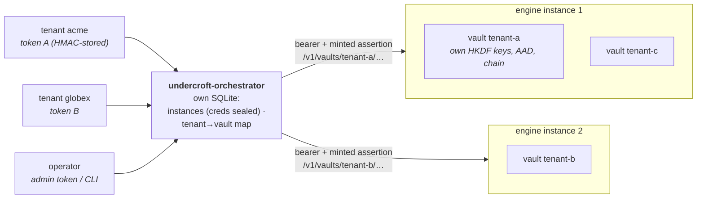
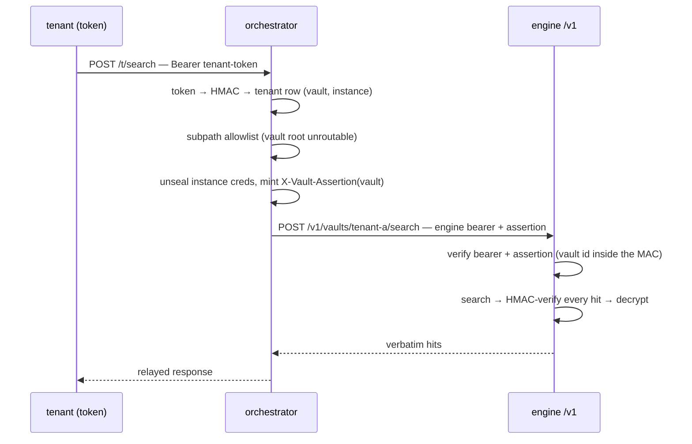
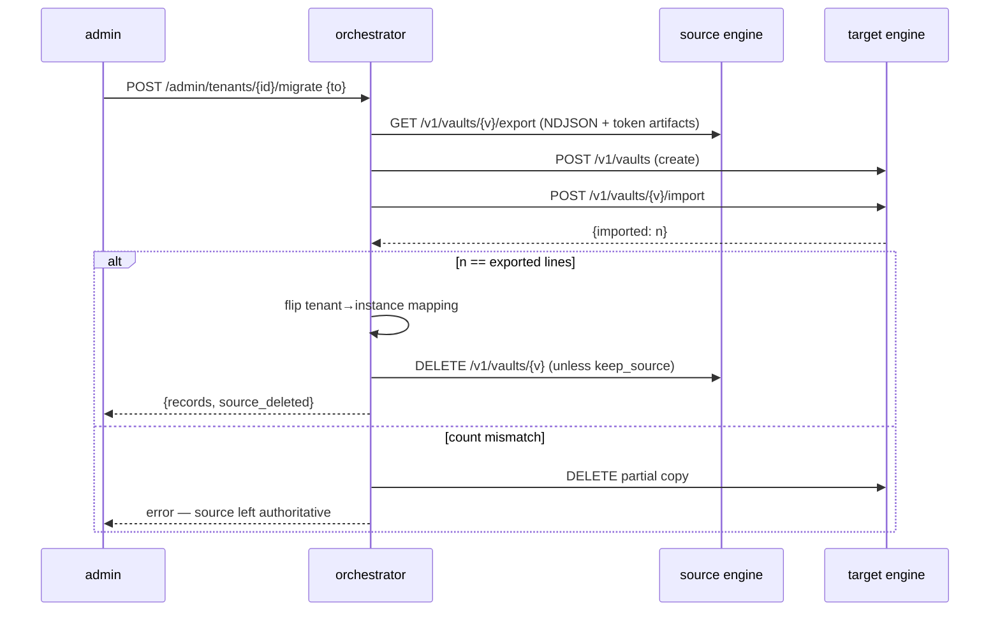

# Multi-tenancy

Undercroft serves many isolated tenants from one process without giving up
its core stance: local-first, verbatim storage, per-vault cryptographic
isolation, append-only audit chains. This document describes the two-layer
model it uses, maps a common external multi-tenant design onto what
Undercroft already implements, and records the design decisions behind the
gaps that were deliberately *not* closed inside the engine.

The unit of tenancy is a **vault**, not a palace. One process hosts one
palace; each customer/tenant gets a vault inside it, with its own
HKDF-derived keys, its own sealed store, and its own audit chain. Nothing
in a vault is reachable from another vault without the right key — isolation
is cryptographic, not merely logical (see [Cross-vault isolation](#cross-vault-isolation)).

## Two layers: engine and orchestrator

Multi-tenant memory splits cleanly into two concerns, and Undercroft keeps
them apart on purpose:

- **Engine** — the per-vault memory store. It is *tree-blind*: it knows
  vaults, wings, rooms, and drawers, but nothing about which tenant maps to
  which vault, how to route a request, how to migrate a vault between hosts,
  or how to mint keys for a new customer. This is what ships in the box:
  `undercroft-store` (per-vault SQLite + hybrid search), `undercroft-vault`
  (keys, sealing, audit chain), and the `/v1` REST surface in
  `crates/undercroft-cli/src/tenant.rs`.
- **Orchestrator** — routing, tenant→vault mapping, token minting, migration,
  instance-pool provisioning, blast-radius isolation. This layer stays
  **out of the engine** so the engine remains tree-blind and portable. It
  **ships as the separate, optional `undercroft-orchestrator` binary**
  (`crates/undercroft-orchestrator`) — a pure client of the `/v1` surface,
  never a dependency of the engine. See
  [The orchestrator](#the-orchestrator) below.

Keeping the orchestrator outside the engine means a single-instance
deployment carries none of its weight, and the engine stays a
self-contained, auditable memory store you can run by hand.

## The `/v1` engine surface

The multi-tenant REST layer lives in the same process and behind the same
palace bearer as `serve-http`, and adds per-vault enforcement plus vault
lifecycle over HTTP. Routes (see `tenant.rs`):

| Method + path | Purpose |
|---|---|
| `POST /v1/vaults` | create a vault (`sealed` or `hmac-only`; optional `external:<name>@<dim>` embedder identity) |
| `GET /v1/vaults` | list vault ids (bearer-gated; disabled under per-vault assertions) |
| `DELETE /v1/vaults/{id}` | delete a vault (409 for the vault the same process serves over `/mcp`) |
| `POST /v1/vaults/{id}/drawers` | save a drawer (deterministic-id upsert; opt-in cosine dedup). **Admission-screened on every arm**; on the default arm a diverted save answers **202** with `quarantined: true` and the id the drawer actually landed under on **every** arm, including `dedup_threshold` and external-vault saves, which reported clean before 1.0.0 (§5) |
| `POST /v1/vaults/{id}/search` | hybrid search (cosine + BM25, optional reranker); declared read-time parameters (`language`, `calendar`, `date_order`, `wing`, `room`, `kind`, `min_trust`, `offset`, `ranked_at`) |
| `DELETE /v1/vaults/{id}/drawers/{drawer_id}` | delete a drawer (refused for quarantine-pending evidence — ruling on it is `admission allow`/`deny`) |
| `GET /v1/vaults/{id}/stats` · `.../stats/history` | stats (records, wings, rooms, kg, tunnels, db size, chain head, codebook generations) + sample ring |
| `GET /v1/vaults/{id}/drawers` · `GET`/`PUT .../drawers/{drawer_id}` | paged browse, full drawer, verbatim content replace. The browse excludes the quarantine wing unless the request names it; the replace is screened on the **updating** surface and answers a typed outcome |
| `GET /v1/vaults/{id}/taxonomy` | wing → room tree with counts |
| `GET /v1/vaults/{id}/supersessions` | receipted drawer supersession chain + its verdicts |
| `GET /v1/vaults/{id}/kg/stats` · `.../kg/entities` · `.../kg/query` · `.../kg/timeline` · `.../kg/receipts` · `.../kg/canonical/{key}` | read-only knowledge-graph browse |
| `POST /v1/vaults/{id}/kg/authority` | the one KG **mutation** on this surface: place a fact on the authority tier (closed vocabulary, audited, HMAC-covered) |
| `POST /v1/vaults/{id}/refine` | LLM distillation of a drawer into KG facts (`UNDERCROFT_LLM_*`; nothing is contacted unless a URL is set) |
| `GET`/`POST /v1/vaults/{id}/trust` · `.../admission` · `.../retention` · `POST .../retention/sweep` · `POST .../forget` | operator surfaces (never MCP): wing trust, admission review, retention policy + sweep, attested forgetting |
| `POST /v1/vaults/{id}/verify` · `POST .../anchor` · `POST .../rotate` | integrity report (a read) · tighten the manifest rollback anchor onto the committed chain head (a **write**: a cached handle never re-opens, so nothing else closes that window) · key rotation (sole-writer contract — 409 for the vault the same process serves over `/mcp`) |
| `GET /v1/vaults/{id}/export` · `POST .../import` | lossless migration pair. Export is **chain-audited unconditionally** (one `egress/export` record binding surface, counts and the export's own manifest digest); import re-stamps `added_by` and screens every record |
| `GET /ui` | vault admin console (static page, every build) |

Stores are opened on demand and cached in a `HashMap` — the `tiny_http`
request loop is sequential (single-threaded), so the cache needs no locking
(`Tenancy` in `tenant.rs`).

### `--read-only` is a posture on the process, not a filter on one port

`serve-http --read-only` used to mean "the `/v1` handlers refuse writes",
and both halves of that were false. The `/mcp` store on the same process
opened read-write, so the `--vault` vault could get a full embedder
migration at start-up and a chain record per `/mcp` search under
`UNDERCROFT_READ_AUDIT=chain`; and on the `/v1` side there were thirteen
per-handler guards for fourteen mutating routes — `POST …/kg/authority`
had simply never been given one, so a read-only replica rewrote
HMAC-covered authority columns and appended to the audit chain while
answering 200.

What it means now:

- **Both stores are opened read-only** (`Posture` is a required argument
  to the open, not a defaulted flag): no embedder migration runs, and
  read auditing is force-disabled with a warning rather than silently
  dropped.
- **The gate sits in front of dispatch and fails closed.** A request
  mutates unless it is a `GET` or one of two named `POST`s, so a route
  added later is refused until someone classifies it deliberately —
  the opposite of a forgotten guard, which is a silent write door.
- **The two `POST` exceptions are POST for cost, not for effect**:
  `search` reads (its optional read-audit record is already suppressed
  by the read-only open) and `verify` walks HMACs and replays the chain.
  `GET .../export` is a read here too — the egress chain record it would
  otherwise write is skipped, and the server **warns and serves** rather
  than refusing the export.
- **The open is a read too** (1.0.0, ROADMAP R4 — this bullet used to
  record the opposite as a residual). The connection is
  `SQLITE_OPEN_READ_ONLY` under `PRAGMA query_only=ON`; no schema is
  created or altered, no `chain_meta` seeded, no anchor fast-forwarded,
  no FTS rebuilt, and no `vault.json.next` promoted or deleted. Each is
  detected and reported instead — as a warning at open and as `unhealed`
  on `GET /v1/vaults/{id}/stats` alongside `read_only`. A prefilter loads
  an existing index and never builds one (R1), falling back to the exact
  scan and saying so once per tier. Two conditions refuse rather than
  report, both 409: an absent `palace.db` under a present manifest, and a
  schema this build would have had to migrate.

### Boundaries in the fleet, stated

Three absences that were absences until 2026-08-05 (ROADMAP C14) — this
project treats a capability missing from one surface as either a boundary or
a drift, and requires that which one be written down:

- **No plane forwards `refine`.** The engine has it and the fleet does not.
  Distillation spends an LLM budget per tenant against a runtime the
  orchestrator does not configure and cannot bound, so it stays an
  engine-local operator act. Run it on the instance.
- **The data plane has its own quarantine fence**, and it is the reading
  half of the boundary `OPS_ROUTES` draws for the ruling half: a `/t/*`
  request that NAMES the reserved wing — in a subpath, a query string or a
  body — is refused 404 before any engine call, and a single-drawer request
  resolves its wing at the engine first. It exists because `/v1` deliberately
  opens the reviewer's door to a caller who names the wing, which is right
  for an operator's own surface and wrong for a proxied tenant token.
- **The audit chain is not on the data plane, and that is a boundary rather
  than an omission.** The engine's `GET /v1/vaults/{id}/history` answers at
  OPERATOR scope — the whole chain, including `admission/{id}/{verdict}` (the
  reviewer's view of the queue that screened this tenant's own writes) and
  `trust/{wing}` (the retrieval policy deciding what it may retrieve).
  Forwarding that to a tenant token is A13 restated one capability later, so
  `history` is absent from `data_subpath_ok`'s allowlist, which is
  fail-closed. The agent-facing half of the capability exists —
  `undercroft_history` on MCP, fenced by namespace and by the reserved review
  wing — but it runs against a local vault rather than through a proxy into
  someone else's operator surface. `stats/history` in the table above is
  unrelated: metrics over time, not the audit chain.
- **That fence's 200-branch is dead against a same-version engine**, which
  refuses first. What remains is defence against an OLDER engine on the
  other end of the proxy — an intent worth stating, because a reader
  otherwise finds an unreachable branch and deletes it.
- **The orchestrator CLI mirrors the admin plane** (`undercroft-orchestrator
  ops <tenant> <op>`) over a closed vocabulary of aliases, each asserted by
  test to resolve to a route the proxy already allows. It had no such
  subcommand until 2026-08-05 while this document claimed it did.

## Mapping an external multi-tenant design onto Undercroft

A common external design for multi-tenant memory lists six requirements
(§1–6 below). Undercroft already implements §1–4 and §6 — often more
hardened than the reference — and takes a deliberate, different position on
§5.

### §1 — Vault-per-tenant isolation — implemented

Each tenant is a vault with its own key material and store. See
[Cross-vault isolation](#cross-vault-isolation).

### §2 — Signed per-request assertions — implemented (verbatim)

A palace-wide bearer can't isolate tenants: whoever holds it addresses every
vault. So when `UNDERCROFT_ASSERTION_SECRET` is set, every vault-addressing
request must also carry a short-lived per-vault assertion
(`crates/undercroft-cli/src/assertion.rs`):

```
X-Vault-Assertion: <ts>:<hex>
  where hex = HMAC-SHA256(secret, "<ts>|<vault_id>")
```

- The **vault id is inside the MAC**, so an assertion minted for vault A
  never authorizes vault B (this is the core multi-tenant guarantee, and has
  a dedicated test: `assertion_for_vault_a_never_authorizes_vault_b`).
- The timestamp is checked against a **±120 s window** (`DEFAULT_WINDOW_SECS`)
  before any MAC work — cheap replay rejection.
- Comparison is **constant-time** (`subtle::ConstantTimeEq`) with a length
  guard first.
- Rejection reasons are logged server-side but **never returned to the
  caller** — they would leak whether a vault exists or how close a forgery
  got. All map to HTTP 401.

The caller platform authenticates its user and mints the assertion; the
engine verifies independently, so a compromised caller component that lacks
the secret gets nothing.

### §3 — At-rest encryption — implemented (stronger)

The reference proposes `[0x01][nonce][ciphertext]`. Undercroft's
`undercroft-vault` layer is stronger:

- **Per-vault keys via HKDF** from the master key (`keys.rs`) — each vault
  derives its own content, MAC, and fingerprint keys; keys live in
  `SecretKey` (zeroize-on-drop, never `Debug`-printed).
- **XChaCha20-Poly1305** content sealing plus an **HMAC-SHA256 integrity
  tag** per record (`seal.rs`).
- **AAD binds the vault id** into every sealing operation, so ciphertext
  from vault A cannot be verified or opened as vault B — cross-vault access
  fails *cryptographically*.
- A **tamper-evident audit chain**: every write advances the committed head
  in the same SQLite transaction as its data (`chain_append` + the
  `chain_meta` row; the manifest keeps a lagging out-of-database rollback
  anchor), and every read verifies the record HMAC before returning.
- Sealed vaults never persist plaintext or any plaintext-derived index
  (embeddings, FTS) to disk — enforced by tests.

### §4 — Vault lifecycle over the API — implemented

Create / delete / stats / export / import are all `/v1` routes (table
above). Export/import is a **lossless** decrypt-then-verified-reimport pair
for migrating a vault between instances.

Two properties of that pair are worth stating, because both were learned
the hard way. **Import screens.** Every `/v1` export line carries a
`vector`, and a caller-supplied vector used to route straight to the raw
writer — so the ordinary backup-restore round trip *and* the
orchestrator's tenant migration re-admitted whole corpora past admission
control. Screening now lives at the store's single write choke point
behind a required argument, so the import path cannot skip it by
construction; the response carries an additive `quarantined` count beside
`imported`. **Import re-stamps `added_by`** with the surface identity
`import`, because that field is the key the trusted-source auto-admit
rides: a bundle whose records claimed `added_by: "cli"` would otherwise
admit itself past the screen under
`UNDERCROFT_ADMIT_TRUSTED_SOURCES=cli`. `import` is deliberately its own
identity rather than `cli`/`rest` — accepting someone else's bytes
wholesale is a distinct act from writing your own, and declaring a save
surface trusted must not silently extend that trust to bundle contents.

### §5 — Cosine dedup-refresh on the write path — deliberately NOT the default

The reference makes an automatic cosine-≥0.95 dedup-refresh part of the
write path. Undercroft **rejects that as a default** because it conflicts
with the engine's invariants:

- **Non-deterministic / embedder-dependent** — a cosine threshold makes the
  write outcome depend on the current embedding model. Drawer ids are
  deterministic over `(wing, room, source, chunk_index, normalize_version)`
  precisely so re-mining is idempotent and reproducible; a cosine gate
  breaks that.
- **Lossy merge of two verbatim records** — collapsing two
  distinct-but-similar drawers discards user data on the write path, which
  the "store verbatim, never lossy-compress" invariant forbids.
- **In-place mutation vs append-only + audit chain** — silently overwriting
  a record is at odds with the append-only, chained history.

What Undercroft does instead:

- **Default write path is deterministic-id `upsert`** (`POST /v1/.../drawers`
  with no `dedup_threshold`): re-ingesting the same logical drawer refreshes
  it by id, idempotently and append-only-friendly.
- **Cosine dedup is opt-in and audited, never silent.** A caller may pass
  `dedup_threshold` per request; then `save_with_dedup` scans the same
  wing+room for the closest existing drawer ≥ threshold and, if found,
  **refreshes it as an ordinary audited update** (re-tagged, chain advanced)
  — explicitly *not* a silent overwrite. Off by default. It is also
  **screened like every other write**: for a while `dedup_threshold` in the
  save body was one of three ways to route around admission control, since
  the dedup path reached the raw writer. Both the refresh and the fresh
  insert now go through the same choke point, so declaring a dedup
  threshold changes what a write *collapses*, never what it is allowed to
  say. **And it reports the verdict now** (1.0.0, ROADMAP R5): that gap
  stood here as "screens but does not yet report" — `save_with_dedup_vec`
  discarded the write's landing, so a diverted dedup save answered 200
  with `quarantined: false` and the aimed-at id, contained but unstated.
  Both branches take `quarantined` and the landed id from the landing, and
  the refresh branch says `deduped: false` when it was diverted, because a
  refresh that went to quarantine did not happen: the matched drawer still
  holds its previous text.
- **Non-destructive near-dup handling** for distinct records: a
  `check-dup`-style report (keyed HMAC fingerprints, `manage.rs`) surfaces
  candidates, and a **KG-supersede** merge (`kg_supersede`, `kg.rs`) appends
  the new record and marks the old one superseded in the chain — history is
  preserved, nothing is overwritten.

### §6 — External embedder + identity lock — implemented

A vault can record an external-embedding identity (`external:<name>@<dim>`)
at create time (`create_vault` in `tenant.rs`); subsequent opens enforce
that identity so a silent model swap is refused. Callers supply the vector
per request for external vaults.

Two guards ride on that path, both closing holes that a caller-supplied
vector opened. **Non-finite components are refused at the write choke
point** (`write_drawer_stmts`, so every write path inherits it): an
`external:` vector containing `NaN`/`Inf` escaped L2 normalization
entirely (`NaN/x = NaN`), and normalization is what bounds a poisoner to
buying influence with *count* rather than *magnitude*. This paragraph
used to say the caller-supplied path was "the one door", and the refusal
sat on `upsert_external` accordingly. **There were three.** The other two
matter here in particular: both arms of `import_record` — which is what
`POST /v1/vaults/{id}/import` and this orchestrator's own tenant
migration drive — took a payload vector unchecked, and the non-external
arm means an ordinary hash vault was reachable. `1e39` is an
unremarkable finite JSON number, and `1e39_f64 as f32` is infinity.
And **an external save is screened at all**; it previously
reached the raw writer with no screen, which was the third of the three
admission bypasses on this surface. Same recorded gap as the dedup arm:
`upsert_external` returns only "was the id new", so a diverted external
save is contained but answers 200 with `quarantined: false`.

## Cross-vault isolation

Isolation is cryptographic, not logical:

- Per-vault HKDF keys mean vault A's data can't be decrypted with vault B's
  keys.
- AAD binds the vault id into every seal, so even a ciphertext copied
  across vaults fails verification.
- Under per-vault assertions, an assertion for A is a 401 against B (the id
  is in the MAC).

A logic bug in routing therefore cannot leak content across tenants — the
worst case is a failed decrypt/verify, not a silent cross-tenant read.

## Reranker sharing (v0.13.0 follow-up)

The optional cross-encoder reranker is a heavy ONNX model. Loading a copy
per vault would be wasteful, so the multi-tenant server loads the model
**once** and hands every per-vault store a cheap `Arc` handle onto that
single shared model:

- `RerankerFactory` (`tenant.rs`) produces a `Box<dyn Reranker>` per store
  open; each call clones a handle onto the one shared model.
- `Tenancy::with_reranker()` attaches the shared reranker to every store as
  it opens; `None` ⇒ first-pass ranking only (the default).
- `main.rs::reranker_factory` loads the model once: `UNDERCROFT_RERANKER=onnx`
  gives one `OnnxReranker` (tract), `=ort` one ONNX Runtime reranker whose
  **session pool is shared across every tenant vault**. Both bail without
  their feature; unset ⇒ `None`. Worst case is two loads — the single MCP
  store plus the shared tenant factory — mirroring how the embedder factory
  already handles the single store's embedder.
- `colbert` / `colbert-ort` are **refused on the multi-tenant server** with
  an error naming the alternatives. The late-interaction stage is per-store
  state (token matrices, a token-PQ codebook, a query encoder bound to the
  vault's own artifacts), not a stateless model handle, so there is nothing
  honest to share; serve a single vault for it.

Reranking is CPU-bound and single-threaded (tract), so on a single instance
it bounds throughput; `UNDERCROFT_RERANK_TOP_N` (default 50) bounds
per-query latency. Measured lift: LoCoMo R@10 94.6 → **97.68** (see
[benchmarks/RESULTS.md](../benchmarks/RESULTS.md)).

## The orchestrator

`undercroft-orchestrator` (shipped v0.25.0) is the control plane the design
above reserved: one binary, its **own** SQLite state, talking to engines
exactly like any other `/v1` caller — palace bearer + freshly minted
per-vault assertion per request. Nothing in it links engine crates.

**Topology** — tenants talk to the orchestrator; the orchestrator talks
to engines over their public `/v1` surface; every engine hosts many
cryptographically isolated vaults:



**Data-plane request** — one hop, auth swapped at the boundary, and the
engine still verifies everything independently:



**Migration** — the v0.18 artifact-carrying export/import as a live
control-plane operation; any failure before the mapping flip leaves the
source authoritative:



**Surface** (single-threaded `tiny_http`, the engine's serving model):

| Route | Plane | Purpose |
|---|---|---|
| `GET /healthz` | — | unauthenticated liveness |
| `GET /ui` | — | the fleet console: a static page driving the whole admin plane (instances, tenants with one-time token reveal, guarded rotation/deletion, migration); the admin token is entered in the page |
| `POST/GET /admin/instances`, `DELETE /admin/instances/{name}`, `GET .../{name}/health` | admin | instance registry (+ live engine probe); removal refused while tenants map to it |
| `POST/GET /admin/tenants`, `DELETE /admin/tenants/{id}` | admin | tenant lifecycle: pick instance (least-loaded default) → create engine vault → record mapping → **return the token once** |
| `GET /admin/tenants/{id}/stats` | admin | metadata-only stats relay (counts, sizes, chain head) via the stored engine creds — content stays behind the tenant's own token |
| `POST /admin/tenants/{id}/migrate` | admin | live migration (below) |
| `GET`/`POST /admin/tenants/{id}/ops/<subpath>` | admin | the **operator plane**: attested forgetting, retention policy + sweep, wing trust, admission review, verify, anchor tightening, supersession receipts — forwarded to the tenant's engine over a closed vocabulary (`OPS_ROUTES` in `proxy.rs`). Deliberately admin-only: a tenant token must not rule on the admission queue that screened its own writes, nor assign the trust its wings are floored by |
| `ANY /t/<subpath>` | data | tenant-token-routed proxy onto `/v1/vaults/{vault}/<subpath>` |

The admin plane sits behind `UNDERCROFT_ORCH_ADMIN_TOKEN`; every auth
failure is a uniform 401. The CLI (`instance-add`, `tenant-create`,
`migrate`, …) mirrors the admin plane for scripted use, plus `keygen`.

**Observe the control plane** (ROADMAP O20, `--features telemetry` builds):

```bash
UNDERCROFT_ORCH_METRICS_ADDR=127.0.0.1:9900 undercroft-orchestrator serve
```

A **separate listener**, not a path on the serving port, and the reason is
structural: the serving port carries `/t/*` and must be reachable by tenants,
so a `/metrics` path there would be network-exposed in every real fleet.
Splitting it lets the data plane sit on `0.0.0.0:8900` while metrics sit on
loopback for a sidecar scraper — and it means a **read replica works
unchanged**, since it has no admin credential and now needs none.

Loopback needs no token. Any other address **refuses to start** without
`UNDERCROFT_ORCH_METRICS_TOKEN` — deliberately not the admin token, which
creates tenants and reads engine bearers, and which a scrape target would hold
in a file on every Prometheus host.

What it exports is **fleet-shaped, never tenant-shaped**: requests by route
class and status, refused credentials by kind, the rate screen firing, and
engine-call outcomes. There is no tenant, vault or tenant-name label — those
identifiers are created by use, so they belong on a query surface, and
per-tenant figures are already on `GET /admin/tenants/{id}/stats`. The series
are `undercroft_orch_`-prefixed so they cannot blend with an engine's in a
dashboard that aggregates without a job filter.

Two things it does not do yet: no gauges (the shared gauge shape is
vault-labelled, so replication lag stays on `/healthz`), and no scrape job or
alert rules ship for it — a fleet adds its own.

**Pre-flight the control plane before a restart**, exactly as you would an
engine:

```bash
undercroft-orchestrator config check    # or: config-check --verbose
```

It runs the four `UNDERCROFT_ORCH_*` declarations this binary reads through
the same resolvers `serve` runs — the sealing key, the admin bearer, the rate
limit and the engine-hop CA pin — and opens no state database and binds no
port. Exit 1 means this environment would refuse to start.

**A fleet runs it alongside `undercroft config check` on each engine, not
instead of it.** The two commands cover different binaries and neither can run
the other's resolvers: the engine is tree-blind and the orchestrator is a pure
`/v1` client, so they do not link. What is shared is the CLASSIFICATION of
each variable, counted across the two inventories in both directions by a
test. Before 1.1.0 this command did not exist and the control plane's
declarations were pre-flighted by nothing at all (ROADMAP O21).

Two of them are worth knowing about. `UNDERCROFT_ORCH_ADMIN_TOKEN` refuses
when it is empty **or ends in whitespace** — HTTP strips a header value's
trailing whitespace, so `$(cat /run/secrets/token)` over a file ending in a
newline used to clear the 16-character floor and produce a control plane that
started cleanly and refused every `/admin` request forever. It is not trimmed
for you: that would authenticate a key you did not declare. And
`UNDERCROFT_ORCH_KEY` now says whether it is *absent* or merely *not hex*,
which used to be one message for both.

**Security model** — the orchestrator state is credential-bearing, so it is
hardened the way the engine hardens its own secrets:

- Engine credentials (bearer + assertion secret) are **sealed at rest**
  (XChaCha20-Poly1305 under `UNDERCROFT_ORCH_KEY`, AAD-bound to the instance
  name — a blob copied onto another row fails to open, mirroring the
  engine's vault-id AAD binding).
- Tenant tokens are **never stored** — only a domain-separated HMAC; the
  token appears exactly once, in the create response.
- The data plane maps a token to **its own vault only**: there is no path
  shape that reaches another tenant, the subpath allowlist keeps vault
  lifecycle off the data plane (the vault root is unroutable), and even a
  routing bug downstream fails cryptographically — the assertion and the
  vault AAD both carry the vault id.
- The data-plane allowlist keeps **operator** capabilities off a tenant
  token too, and that is now stated rather than incidental: forgetting,
  retention, trust, admission and verify live on the admin plane's
  `ops/` prefix. The one deletion a tenant token reaches
  (`DELETE /t/…/drawers/{id}`) produces a bare tombstone, so an erasure
  request should be answered through `ops/forget`, which returns a
  chain-attested receipt. A data-plane request for an operator subpath
  now says so instead of answering a bare `unknown route`.

**Migration** (`POST /admin/tenants/{id}/migrate {"to": …}`): export from
the source (the v0.18 artifact-carrying NDJSON, so token matrices restore
by copy, not re-encode) → import on the target → **count-verified** →
mapping flip → source vault delete (`keep_source` opts out). Any failure
before the flip leaves the source authoritative and removes the partial
copy. The import half is admission-screened like any other write — a
migration used to be a re-admission of the whole corpus past the screen,
because every export line carries a `vector` and a caller-supplied vector
reached the raw writer (§4). The e2e suite (`tests/e2e-orchestrator.sh`, 95 checks,
`docker compose run --rm orchestrator-e2e`) exercises the whole story
against two live engine instances, including the source engine provably
losing the vault after migration and a read replica converging on the
writer's rotations. The 13 checks added 2026-08-05 are the boundary ones:
eight path-traversal shapes reaching the operator plane through the data
plane (plus the percent-encoded spelling), a cross-tenant climb into
another tenant's vault, a replica refusing data-plane writes while still
serving `POST search`, and the query string actually arriving at the
engine.

### Deploying the orchestrator (hardening)

- **Bind loopback, terminate TLS in front.** The orchestrator (like the
  engine) listens on `127.0.0.1` by default and speaks plain HTTP; put a
  reverse proxy (Caddy, nginx, or your ingress) in front for TLS and let
  it forward to the loopback port. The same applies to the
  orchestrator→engine hop when engines live on other hosts: point the
  instance `url` at an HTTPS reverse proxy in front of each engine.
  **This is now enforced rather than advised**: the orchestrator builds
  its engine client through `undercroft-net`, which refuses cleartext to
  any non-loopback host at construction, with no override — the same
  rule the embedder, the LLM clients and the index backends obey. A
  fleet registered at `http://engine.internal:8080` is refused; declare
  a self-signed root with `UNDERCROFT_ORCH_ENGINE_CA` if you terminate
  TLS yourself. Known residue, recorded in ROADMAP: the variable is read
  per outbound call rather than at startup, so a bad pin binds the port
  and fails per request instead of refusing to start.
  Everything auth-bearing (tenant tokens, engine bearers, assertions)
  must only ever transit inside TLS or on loopback.
- **Rate limiting** (`UNDERCROFT_ORCH_RATE_LIMIT`, requests/minute per
  tenant, off by default): applied on the data plane *after* token
  resolution, keyed per tenant — one noisy tenant is throttled (429),
  the rest are untouched. Blast-radius isolation, applied to request
  volume. A plain positive integer declares it; unset, `0` and `off`
  mean off; **anything else refuses to start**, because a limit that
  silently failed to parse would serve unlimited traffic with nothing
  said in `/healthz`, the console, or the log.
- **Token rotation** (`POST /admin/tenants/{id}/rotate` or
  `tenant-rotate`): mints a fresh token and revokes the old one **in the
  same statement** — rotation *is* the revocation primitive; there is no
  grace window. The new token appears once, in the response.
- **State backup and the single-writer stance.** The orchestrator state
  is one SQLite file: credentials sealed, tokens MAC-only — a copied
  file without `UNDERCROFT_ORCH_KEY` yields nothing. Back it up like any
  file; losing it strands no data (tenant data lives in engine vaults —
  re-register instances, re-mint tokens). It is deliberately
  **single-writer**: run exactly one orchestrator that mutates state.
  For availability and read throughput beyond that one process, add
  **read replicas** (below) — never a second writer.
- **Read replicas** (`serve --read-replica`, v0.40.0): a replica opens
  the state database **read-only** and serves only `/healthz` and the
  `/t/*` data plane — token resolution is a pure HMAC lookup, so
  replicas scale routing horizontally while minting, rotation, and
  migration stay on the writer (`/admin/*` and `/ui` answer 403
  pointing there; every mutation is refused at the state layer and by
  the read-only connection, and a replica refuses to start on a
  missing database). Two deployment shapes:
  - **Shared volume** — point `--db` at the writer's file; SQLite WAL
    supports concurrent readers, so replicas observe every commit
    immediately (zero lag). This is what the e2e suite exercises.
  - **Replicated snapshot** — ship the file litestream-style and point
    the replica at the restored copy; **lag = the replication
    interval**. The trade is explicit: a revoked or rotated token
    keeps working on a replica for at most that window (revocation is
    row replacement, so it propagates with the file), while the writer
    kills it in the same statement as always.

  `/healthz` on both roles reports `mode` (`writer`/`read-replica`)
  and `last_write` (unix seconds of the last control-plane mutation) —
  diff a replica's `last_write` against the writer's to read the lag.
  Note the per-tenant rate limiter is per-process state: each replica
  enforces `UNDERCROFT_ORCH_RATE_LIMIT` over its own traffic, so the
  fleet-wide ceiling is the limit × (1 + replicas).
- **Secrets hygiene**: generate `UNDERCROFT_ORCH_KEY` and the admin token
  with `keygen`; pass them as environment, never in URLs. On shared
  hosts prefer the HTTP admin plane over CLI flags for instance
  registration (argv is visible to other local users).

## Latency and the orchestrator compose cleanly

The single-threaded `/v1` loop with reranking has a throughput ceiling
(~1 reranked query/sec/core). The two scaling levers stack:

- **Per-query parallelism** cuts *single-instance* latency: rayon over the
  rerank forwards, and — since the phase trace found the real hotspot in
  `fuse` rather than in hydration where everyone assumed it was —
  over candidate hydration, the stage-2 exact-cosine decrypts and BM25's
  per-candidate tf rows, order-preserving and byte-identical.
- **Orchestrator instance-pool + dedicated-store provisioning** gives
  *multi-tenant throughput* and blast-radius isolation — one tenant's load
  or a poisoned store can't stall another.

The first lives in the engine; the second lives in the orchestrator. That
separation is the whole point: the engine stays a portable, auditable,
tree-blind memory store, and scale-out is an optional layer on top.
