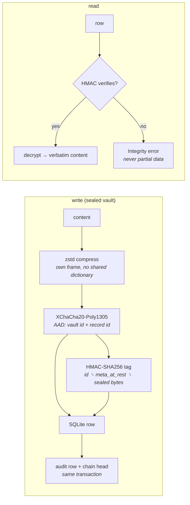
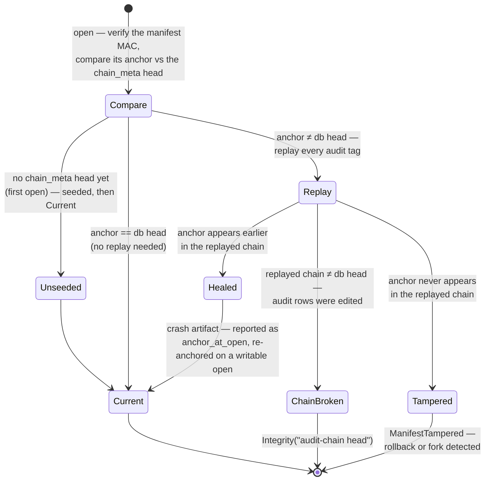
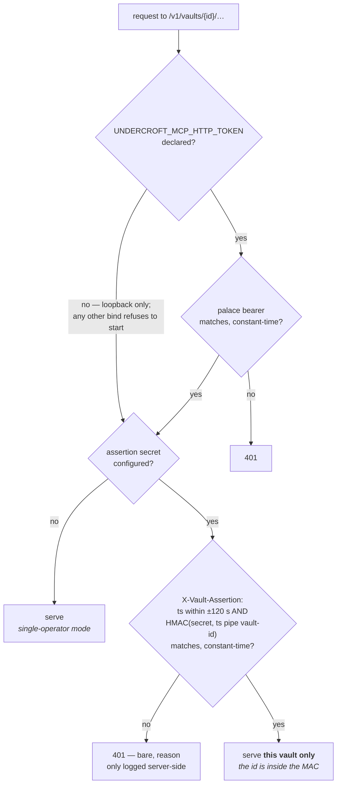

# Security model

## Goals

Protect memories **at rest** against disk theft, cross-vault bleed, and
offline tampering of the database or manifest. Detect (not just resist)
modification: every read verifies, `verify` audits everything.

## Mechanisms

- **Master key**: 32-byte key file (0600) or Argon2id(passphrase, salt),
  64 MiB / t=3. Keys zeroized on drop; never logged. Key material is created
  only in an installation nothing refers to yet, never under a read-only open, and a
  declaration the key files contradict is refused before anything is derived
  (ROADMAP O204). The key files are unauthenticated, so they decide nothing
  about which key sealed a vault; the manifest MAC does.
- **Per-vault keys**: `HKDF-SHA256(master, vault_salt, "undercroft.v1/vault/<id>/<label>")`
  for enc / mac / manifest / sample / chain labels. `sample` keys the PQ
  training-sample rank and is deliberately rotation-sensitive, because
  nothing holds a durable reference to it; `chain` keys the version-2 audit
  chain step, whose heads leave the vault on `/v1` and to the orchestrator
  (ROADMAP O233). Vaults never share working keys.
- **Compression**: sealed content is zstd-compressed *before* encryption
  (compress-then-encrypt; the reverse leaks nothing but gains nothing).
  Note the standard caveat: at-rest sizes correlate weakly with content
  compressibility.
- **Sealing**: XChaCha20-Poly1305, random 24-byte nonce, AAD binds
  `vault_id + record_id` — ciphertext cannot be replayed across vaults or
  record slots. Sealed vaults encrypt content *and* embeddings; nothing
  content-derived is written to disk in plaintext (no FTS index either)
  except the unsealed `meta_json`, which keeps resolutions — offsets and
  ISO dates — and never words (the exposure is pinned by test).
  hmac-only vaults — which store plaintext by choice — keep an FTS5 BM25
  prefilter index. Like embeddings, it is derived data outside the HMAC
  envelope: tampering with it can hide records from *search* (an
  availability attack, self-healed by an index rebuild) but can never
  forge a record, since every returned row still verifies its HMAC.
- **Integrity**: HMAC-SHA256 per record (independent key) over
  id + metadata + at-rest content; append-only audit table; chain head
  `h_i = HMAC(chain, "undercroft.chain.v2" ‖ lp(h_{i-1}) ‖ lp(record_id_i) ‖
  lp(tag_i) ‖ lp(at_i))` committed in `chain_meta` in the same transaction
  as the write, and anchored in a MAC'd manifest. Deletions log keyed
  tombstones. KG triples and tunnels carry tags too.
  **The step covers each record's LABEL and TIME, not only its tag, since
  1.6.0 (ROADMAP O233).** The version-1 step, `HMAC(mac, h_{i-1} ‖ tag_i)`,
  left `audit.record_id` outside the chain, and every check that finds a
  record by its label — the trust floor's policy comparison, the
  orphan-label leg, a forget attestation's recorded run — was one `UPDATE`
  away from being defeated: measured, relabelling a quarantined wing's
  `trust/` record and deleting its row read `VERIFY OK` while a floored
  search returned the quarantined drawer. A vault switches at its first
  writable open under 1.6.0 by appending one `migrate/chain-v2` record whose
  tag is an unkeyed SHA-256 over every earlier row's label, tag and time;
  `verify` checks that commitment as its own leg, and a relabel on either
  side of it fails. **Residual, stated**: labels as they stood at the switch
  are bound as found, so a relabel made before the upgrade becomes authentic
  — O232's residual, one table over.
  **Since ROADMAP O237 the readers do not act first.** Every reader that
  DECIDES from a label — the trust floor, the retention sweep and listings,
  the forgetting path, and the version check on every returning read — goes
  through one door that replays the chain once per handle on its first such
  read and then holds a per-key append-only invariant on every one of them,
  refusing a chain that does not replay as an integrity verdict that names
  `undercroft verify`. `PRAGMA data_version` decides when the replay is
  re-run and never whether the invariant applies — and because that cookie
  is comparable only within one connection, a handle that replaces its
  connection re-runs the replay too (ROADMAP O276), as it does after its own
  key rotation (O266). Two carve-outs, both
  stated rather than discovered: a version-1 chain does not refuse on unbound
  labels, because that would stop every pre-1.6.0 vault, including one served
  `--read-only` which cannot switch; and a forget attestation's mirror
  disclosure does not refuse, because that trades the erasure promise for
  availability — its `meta` marker is HMAC-covered instead, and a rotation
  refuses to re-tag one that does not verify. Residual: an APPEND is
  legitimate, so only a replay can tell a forged appended record from a real
  one, and one written beneath SQLite is unseen by a handle that has already
  replayed until it re-opens. *Corrected 2026-09-24 (ROADMAP O247), beside
  the text above:* the per-key invariant runs on the reads that look a label
  up through the handle — the policy readers, the forgetting path, the
  rotation boundary — and NOT on the returning read's version check, which
  pins no drawer label. And the residual is wider than an append: between
  replays a writer without the key re-points a label's newest record by a
  copy-forward, a relabel or a delete, most of which move no height, and a
  replayed policy then governs, the sweep destroys while reporting success,
  and a replayed drawer is served — measured, pinned as a cost, ROADMAP O252.
  The guard defends against a writer who does not hold the key; a
  deployment that keeps `master.key` beside the database gives most such
  writers the key. A legitimate concurrent writer no longer makes it refuse
  as tampering: since 1.7.0 every judgement reads what it compares — the
  replay, the committed head, the rows it acts on — from ONE database state,
  and reads the manifest anchor before that state is pinned (ROADMAP O253).
- **Duplicate detection** uses keyed fingerprints (truncated HMAC), so
  stored fingerprints reveal nothing offline.

What one record goes through, at rest and on read:

The audit chain reconciles at every open — a crash is never a false
alarm, a rollback always is one:

- **Durability backs the reconciliation story**: the store pins SQLite to
  WAL + `synchronous=FULL`, so a data+chain commit is on disk before its
  manifest anchor can be — a power loss leaves the anchor equal or behind
  (the healed crash case), never ahead (the alarm case). The anchor itself
  is written durably (fsync before the atomic rename, directory synced
  after), and key material is fsynced at creation.
- **The external witness** (`undercroft witness emit` / `check`,
  `GET`/`POST /v1/vaults/{id}/witness` — ROADMAP O245): what the anchor
  reconciliation above cannot see is a vault rolled back to a GENUINE
  earlier state, both files restored together, and the witness is the
  document that sees it — emitted by the vault, kept where the offline
  attacker cannot write, checked on return. It binds the audit row count
  and an unkeyed, count-bound digest over the rows' preserved
  `(record_id, tag, at)` bytes, deliberately NOT the chain head: both chain
  steps are keyed, a rotation re-steps every head, and this attacker holds
  the key and can rotate, so a head-only witness would read "superseded" on
  the rollback it exists to catch. The head rides as corroboration and the
  check says when a rotation has retired it. It closes the rewind direction
  below the witnessed height and nothing above it: an append after the
  witness, forged or not, is writes since the witness. Always read-only on
  the CLI; a rollback is exit 2 / 409 `class: "integrity"`; off MCP by
  ruling, since an agent's memory is this vault.
- **Key rotation** (`undercroft vault rotate <name>`): the vault gets a
  fresh salt ⇒ fresh enc/mac/manifest keys; every sealed blob is
  re-encrypted byte-exact at the seal layer (AAD domains preserved) and
  every integrity tag, keyed fingerprint, and the audit chain re-keyed —
  all in **one transaction**, with a two-phase manifest swap
  (`vault.json.next` staged durably, promoted only after the commit; a
  `keycheck` marker in the database tells a crashed rotation's reopen
  which side committed). A crash at any moment leaves the vault openable
  under exactly one key generation. **Since 1.7.0 it holds the vault alone** (ROADMAP
  O257): an exclusive lock on the rotating store's own connection, from
  before its checks until the new manifest is written, refuses the rotation
  (exit 1, 409 without a class) while any other process or handle has the
  vault open, and every audited write checks that the database's
  key-generation marker is still its handle's before it commits. Audit tags of superseded content are
  preserved verbatim (their plaintext is gone by design); the chain over
  them is what rotates. Remote-index copies hold old-key ciphertext
  afterwards — re-run `index push`. **A rotation refuses a vault that
  `verify` fails on a leg it would rewrite** — a record whose HMAC fails,
  a broken audit chain, a tampered receipt, a policy row that is not its
  newest assignment — because re-keying recomputes every tag from the
  current columns and would make the tampering authentic (ROADMAP O232).
  Run `undercroft verify` first. What a rotation by an earlier binary
  re-keyed cannot be told apart any more: the old key was the only witness.
  A relabelled audit row after the chain's switch is a broken chain and
  refuses the rotation; one before the switch is the label commitment's
  finding, which the rotation preserves verbatim and does not refuse over.
- **Encrypted export bundles** (`undercroft export --to <recipient>`): a
  backup or migration file never exists in plaintext. Since C3.4 the
  recipient identity is **hybrid post-quantum** — X25519 **and**
  ML-KEM-768, both halves in one `pq1`-prefixed string from `bundle
  keygen`. A v2 bundle derives its file key from **both** shared secrets
  (HKDF ikm = `DH(eph, recipient_x) ‖ kem_shared`, with the magic, the
  ephemeral key and the KEM ciphertext all bound as AAD), which is what
  closes harvest-now-decrypt-later on the one asymmetric exchange in the
  codebase. Legacy bare-hex X25519 identities still parse and still
  receive v1 bundles (age-style ephemeral-static ECDH → HKDF-SHA256 →
  XChaCha20-Poly1305, header as AAD), and a hybrid identity opens an old
  v1 backup with its curve half — but **nothing downgrades silently**: a
  hybrid recipient never gets a v1 bundle, and an X25519-only secret
  handed a v2 bundle gets a typed refusal, pinned by test. A bundle alone
  reveals nothing without the identity key, and the identity key is
  unrelated to the vault's own at-rest keys. `import --identity
  <keyfile>` opens it. Full posture and compatibility matrix: [PQ.md](https://sealcroft.com/undercroft/docs/pq.html).
- **Signed manifests** beside the recipient flow: encryption says who may
  *read* a bundle, an Ed25519 sender attestation (`bundle sign-keygen`,
  `export --sign`) says who *wrote* it — scope, trust claim, expiry,
  counts, provenance, and a payload digest that is checked
  unconditionally. Pin the sender with `import --sender <hex>`. A
  sender-declared trust label is a **claim, never a boundary**
  ([LABELS.md](https://sealcroft.com/undercroft/docs/labels.html)); legacy payloads import unattested and say so.
- **Remote indexes** receive sealed bytes + plaintext embeddings only;
  results are re-verified locally. See the trade-off note in the README.
- **HTTP server**: refuses non-loopback binds without a bearer token.
  `--read-only` is a **posture on the whole process**, and it refuses at
  the **call**, not in the catalogue — `tools/list` still advertises every
  tool, and a mutating one answers `server is read-only: <name> is not
  allowed`. (This line used to say it "strips all mutating tools"; it does
  not, and a client that filters its own UI off the catalogue would show
  buttons that cannot fire.) On `/v1` the gate sits in front of dispatch
  and **fails closed**: every non-GET is refused unless named, and the three
  named reads are `POST …/search`, `POST …/verify` and
  `POST …/verify-forgetting`. **The open is
  covered too since 1.0.0** (ROADMAP R4): this line used to say the open
  itself writes — schema creation, chain init, and a rotation reconcile
  that could promote or delete a staged `vault.json.next`. The connection
  is now `SQLITE_OPEN_READ_ONLY` under `PRAGMA query_only=ON`, the schema
  is checked rather than created, a lagging anchor is reported rather than
  healed, and a staged rotation is left on disk; what was declined is
  readable as `unhealed` on every stats surface — where, since 1.7.0
  (ROADMAP O246), a writable open also states the anchor heal it made and
  how far behind the anchor was, because that heal is the one observable
  of a restored older manifest. An absent `vault.db`
  under a present manifest and an unmigrated schema both refuse with 409
  rather than being papered over. Residue: SQLite's WAL scaffolding
  (`-shm`, a zero-length `-wal`) is still materialised where the directory
  is writable, so if you need a byte-frozen vault, stop the server rather
  than restarting it read-only, and take the incident runbook's step-1 copy.

## Server auth model (two layers)

The HTTP server distinguishes *reaching the server* from *addressing a
tenant*:

1. **Palace-wide bearer** (`UNDERCROFT_MCP_HTTP_TOKEN`) — mandatory for any
   non-loopback bind, gates every authenticated route (MCP and REST).
   Proves the caller reached the right server; it does not distinguish
   vaults, so on its own whoever holds it can address every vault.
   Since 1.1.0 a declaration that **names no token** refuses to start rather
   than silently serving without a gate (which on a loopback bind meant every
   process on the host), and so does one ending in **whitespace** — HTTP
   strips a header value's trailing whitespace, so such a token can never be
   presented and the server would refuse every client forever with an
   unexplained 401. Neither is trimmed for you: that would authenticate a key
   you did not declare.
2. **Per-vault assertion** (`UNDERCROFT_ASSERTION_SECRET`, optional — but a
   declaration that names no secret **refuses to start** since 1.1.0, rather
   than silently disabling this whole layer; unset it to decline it) — when
   set, every `/v1` request **and every `POST /mcp` call** must carry
   `X-Vault-Assertion: <ts>:<HMAC-SHA256(secret, "<ts>|<vault_id>")>` for
   the exact vault it addresses. The vault id is bound into the MAC, so an
   assertion for vault A cannot authorize vault B; timestamps outside ±120s
   are refused; comparison is constant-time. The caller platform authorizes
   its user and mints the assertion, and the engine verifies independently
   — a compromised caller component without the secret gets nothing. This
   is what makes a multi-tenant host (vault = customer) safe: the engine,
   not the caller, enforces per-tenant access on every request. Failures
   return a bare 401; the reason is logged server-side, never returned (it
   would leak vault existence or how close a forgery got).

Fusion and external-embedding vaults do not change any of this: search only
re-ranks already-HMAC-verified candidates, and caller-supplied vectors are
sealed exactly like internally-computed ones.

## Non-goals

An attacker reading process memory while a vault is unlocked; a compromised
host OS; traffic analysis of remote-index queries; embedding-inversion
resistance for vectors pushed to remote indexes (documented, opt-in).

## Levels

`sealed` (default): everything above. `hmac-only`: plaintext content with
full integrity tagging + chain — for vaults where grep-ability outweighs
confidentiality.
