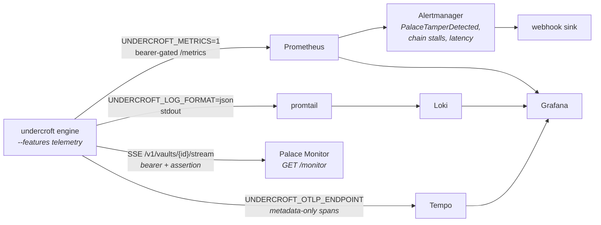

# Observability

Undercroft ships an **opt-in** observability layer: structured logs, a
Prometheus `/metrics` endpoint, and OpenTelemetry (OTLP) trace/metric
export. It is built to preserve the project's stance:

- **Off by default.** A standard build carries none of the telemetry
  dependencies and no runtime overhead — the layer only exists when you
  compile with `--features telemetry`.
- **Local-first / no phone-home.** Nothing leaves the process unless you
  explicitly point it somewhere: `/metrics` is served only when you ask,
  and OTLP export happens only when `UNDERCROFT_OTLP_ENDPOINT` is set.
- **Metadata only.** Every signal is a count, a rate, a latency, or an
  aggregate gauge. Drawer content, drawer names beyond what `stats`
  already exposes, and key material are **never** emitted. Sealed vaults
  expose only aggregate counts.

The full opt-in pipeline — every edge exists only when its gate is set,
and every signal is metadata/counts only:



## Building with telemetry

```bash
cargo build -p undercroft-cli --release --features telemetry
```

Without the feature the same binary runs identically, and hitting
`/metrics` (if enabled) returns `503` with a hint to rebuild.

## Structured logs

With the feature on, diagnostics become `tracing` events.

| Variable | Default | Meaning |
|---|---|---|
| `UNDERCROFT_LOG` | `warn,undercroft=info` | `EnvFilter` directives |
| `UNDERCROFT_LOG_FORMAT` | `text` | `json` for machine-readable logs |

## Prometheus metrics

```bash
UNDERCROFT_METRICS=1 undercroft serve-http --host 127.0.0.1 --port 8765
curl -H "Authorization: Bearer $UNDERCROFT_MCP_HTTP_TOKEN" \
     http://127.0.0.1:8765/metrics
```

`/metrics` is **opt-in** (`UNDERCROFT_METRICS=1`), served on the bind
address (loopback unless you deliberately expose the server), and sits
**behind the same bearer token** as the rest of the server. It is absent
(`404`) when the flag is unset.

Exposed series (all `undercroft_*`):

- **Counters** — `search_total{fusion}`, `search_prefiltered_total`,
  `search_wings_probed_total` (how many per-wing indexes served one
  query's candidates — the honest cost metric for anything fan-out
  shaped; a count, never a wing name),
  `drawer_writes_total{outcome}` (`created` / `deduped` / `quarantined` —
  a third VALUE on its one `outcome` label since 1.0.0, because a diverted write was counted as
  `created` on every write arm, which is a durable signal that is *wrong*
  rather than merely missing; the counter and the live frame are now
  emitted from one function so they cannot be classified differently),
  `drawer_deletes_total`,
  `kg_writes_total{kind}`, `chain_commits_total` (audit-chain RECORDS,
  not manifest anchors — a 256-drawer bulk transaction anchors once and
  advances this by 256, and records appended without an anchor, such as
  read-audit records, are counted by the next anchor),
  `hmac_verify_failures_total{surface}`, `vault_opens_total`,
  `http_requests_total{route,status}`, `auth_rejections_total{kind}`.
- **Histograms** — `search_duration_seconds`, `search_hits`,
  `http_request_duration_seconds{route}`.
- **Gauges** (per vault) — `drawers`, `audit_chain_height`, plus
  `kg_triples` / `kg_entities` / `store_bytes` where sampled, and the
  five **codebook generation** counters —
  `codebook_generation_pq_codebook`, `…_pq_ivf`, `…_fde_codebook`,
  `…_fde_ivf`, `…_tok_codebook`. A step means every row coded against
  the previous generation was re-coded (or, for the IVF pairs,
  re-partitioned: the code bytes are unchanged and the candidate set
  moved). They sit outside HMAC coverage, so they are evidence about
  ambiguity in a retrieval result, never about tampering.

A gauge name must appear in `undercroft_obs::GAUGE_NAMES` or the value is
dropped without a trace — write-only telemetry that looks live at the
call site and never reaches `/metrics`. The list is public so a producer
can pin the names it emits against the names actually registered.

`hmac_verify_failures_total` is the headline signal: any non-zero value
means a record, KG triple, tunnel, or vault manifest failed HMAC
verification — i.e. tamper was detected on read.

## OpenTelemetry (OTLP)

Set an endpoint to export traces and metrics over OTLP/HTTP:

```bash
UNDERCROFT_OTLP_ENDPOINT=http://localhost:4318 \
UNDERCROFT_SERVICE_NAME=undercroft \
undercroft serve-http
```

| Variable | Meaning |
|---|---|
| `UNDERCROFT_OTLP_ENDPOINT` | OTLP/HTTP collector base URL. **Unset ⇒ no network egress.** |
| `UNDERCROFT_SERVICE_NAME` | `service.name` resource attribute (default `undercroft`). |
| `UNDERCROFT_OTLP_HEADERS` | Optional headers for the exporter. |

Spans cover the hot paths (search, save/dedup, KG writes, vault
seal/commit). Export is synchronous and thread-based — the server itself
stays fully synchronous, with no async runtime introduced.

## The full stack (Grafana)

A ready-to-run stack lives in `deploy/observability/` — a telemetry-built
Undercroft server wired to the full operability picture: **metrics**
(Prometheus), **logs** (Loki), **distributed traces** (Tempo), and **alerting**
(Alertmanager), all rendered in **Grafana**.

```bash
cd deploy/observability
docker compose -f docker-compose.observability.yml up --build
# Grafana → http://localhost:3000  (dashboard: "Undercroft — Palace")
```

```
undercroft (telemetry) ──/metrics──▶ Prometheus ──rules──▶ Alertmanager ──▶ alert-sink
          │  │                          │                                    (webhook)
          │  └──JSON logs──▶ promtail ──▶ Loki ──┐
          └──OTLP traces────────────────▶ Tempo ─┤
                                                 └──▶ Grafana (+ image-renderer)
```

The dashboard surfaces request rate by route, search rate and p95/p50 latency,
drawer writes (created vs deduped), audit-chain commit rate, HTTP 5xx and auth
rejections, tamper broken out by surface, recent logs and traces, active
alerts, and — front and centre — the **HMAC-verify-failures** stat that turns
red the instant tamper is detected.


### Alerting (Prometheus + Alertmanager)

Prometheus evaluates `alerts.yml` and pushes firing alerts to Alertmanager,
which routes them to a receiver. The demo stack ships a tiny **`alert-sink`**
webhook that logs every delivery, so the whole path is visible without external
credentials — swap in Slack/email/PagerDuty in `alertmanager/alertmanager.yml`.

| Alert | Severity | Fires when |
|---|---|---|
| **PalaceTamperDetected** | critical | any HMAC-verify failure — the `surface` label says where (`drawer`/`kg`/`tunnel`/`manifest`). |
| **AuditChainStalled** | warning | writes are landing but the audit chain isn't advancing. |
| **UndercroftDown** | critical | the `/metrics` target is unscrapable. |
| **HighSearchLatencyP95** | warning | search p95 > 500 ms. |
| **HttpServerErrors** | warning | any HTTP 5xx. |
| **AuthRejectionsSpike** | warning | elevated bearer/assertion rejections. |

A firing tamper alert links straight to the [tamper runbook](runbook.md) —
where it happened, and how to confirm, mitigate, fix, and prevent it.

Every rule is aggregated `by (instance)`, so an alert names the process that
is slow or erroring rather than reporting that somebody, somewhere, is — and
Alertmanager's inhibition (a critical silences warnings **on that instance**)
has a label to compare on. That detail is load-bearing: a label missing from
both sides of an `equal:` counts as equal, so scoping an inhibition by a label
no rule emits silences the entire fleet instead of one host. The shipped
config did exactly that, and the only symptom was an alert that never
arrived. `docker compose run --rm obs-config` now evaluates the rules with
Prometheus's own `promtool`, asserts the exact label set each one emits, and
fails if the inhibition equals on anything they do not all carry.


### Logs & traces (metadata only)

With `UNDERCROFT_LOG_FORMAT=json`, promtail ships Undercroft's structured logs to
Loki; with `UNDERCROFT_OTLP_ENDPOINT` set, request/search/save/kg spans export to
Tempo. Both carry **only metadata** — operation names, routes, the `surface`
label, vault ids, counts and durations. Query text, drawer content, wing/room
names, and key material are **never** emitted, so you get full traceability
without leaking what's in the palace.


Here the logs even carry the tamper signal: `integrity failure — HMAC
verification failed on drawer`, tagged with the operation span — traceable,
but content-free.

See `deploy/observability/README.md` for ports, the tamper-demo commands, and
the security notes.

## Live stream (SSE)

Prometheus is pull-based; for a **live** view the multi-tenant server also
pushes an [SSE](https://developer.mozilla.org/docs/Web/API/Server-sent_events)
stream per vault — a periodic sample of aggregate counts plus discrete
event pings as they happen. This is what the [Palace Monitor
UI](#palace-monitor-ui) below consumes. Telemetry build + bearer
required; sealed vaults stream only aggregates (wing/room names
suppressed).

```bash
# live event stream (Ctrl-C to stop)
curl -N -H "Authorization: Bearer $TOKEN" \
     http://127.0.0.1:8765/v1/vaults/<id>/stream

# recent samples for backfill
curl -H "Authorization: Bearer $TOKEN" \
     "http://127.0.0.1:8765/v1/vaults/<id>/stats/history?window=100"
```

Frames:

- `event: sample` — `{ts, drawers, rooms, wings, kg_triples, kg_entities,
  kg_active, tunnels, chain_height, db_bytes, sealed}`. Emitted on the
  sampler tick (default 2s, `UNDERCROFT_SAMPLE_INTERVAL_MS`), and only for
  vaults with an active subscriber.
- `event: drawer-saved` / `drawer-quarantined` / `drawer-deleted` /
  `search` / `kg-triple` / `chain-commit` — discrete pings carrying vault +
  (for hmac-only vaults) wing/room. `drawer-quarantined` is a write the
  admission screen DIVERTED: it carries the intended wing/room and the
  tier-1 signal codes (a closed vocabulary — never the flagged text, never
  its offsets), and it is deliberately not a `drawer-saved` into a wing
  named `quarantine-pending`. `chain-commit` carries `records`, how many
  chain records that anchor committed. A comment heartbeat (`: ping`) every 15s keeps the
  connection detectably alive.

Each connection is served on its own thread (the request is handed off so
the single-threaded server keeps serving), reading only from an in-process
broker — never a vault store — so streaming can never touch content.

## Palace Monitor UI

A telemetry build also serves a self-contained pixel-art dashboard at
**`GET /monitor`** (unauthenticated static page — no secrets in it):

```
http://127.0.0.1:8765/monitor
```


Enter the palace bearer token, pick a vault (from `GET /v1/vaults`, or type
the id), and connect. An archivist files drawers into wings as writes land,
searches pulse the wings, the audit chain stamps on each commit, and the
**ambulance beacon** fires on a real HMAC-verify failure (tamper) — the same
`hmac_verify_failures` signal, live. Until you connect it runs in demo mode
with synthetic events. Sealed vaults stream aggregate counts only (wing/room
names suppressed server-side).

The beacon is not decorative. Corrupt a single drawer's bytes on disk and the
next read fails its HMAC; a genuine `hmac-fail` stream event floods the palace
red. It fires only on real integrity failure — never a synthetic alarm.


The page uses `fetch()` streaming (not `EventSource`, which can't send an
`Authorization` header) and is fully self-contained — no external requests,
same-origin only. It targets bearer-only servers; with per-vault assertions
enabled the stream is rejected (the UI shows it) since a browser can't mint
an assertion.
