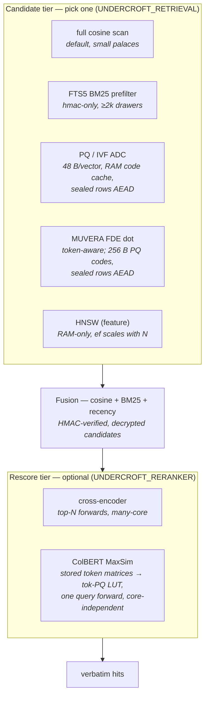

# Retrieval, scoring & scaling

Undercroft's search is a configurable pipeline, not a fixed stack. This page
documents how it works, what was **measured** (full datasets, inside Docker, on
real hardware), and which options to pick for which deployment — from a 4-core
edge box to a many-core server.

Every measurement below is reproducible with the harnesses in the repo; recall
figures and exact commands are in
[`benchmarks/RESULTS.md`](https://github.com/compufreq/undercroft/blob/main/benchmarks/RESULTS.md).
The engineering rationale is in
[`docs/RETRIEVAL_SCALING.md`](https://github.com/compufreq/undercroft/blob/main/docs/RETRIEVAL_SCALING.md).

## The pipeline

1. **Candidate generation** — shortlist drawers for a query.
2. **Fusion** — hybrid rank of the candidates (semantic cosine + Okapi BM25 +
   recency).
3. **Scoring (optional)** — a second stage that re-orders the top candidates
   for accuracy.

The two dominant costs — *candidate generation at scale* and *scoring* — are
**independent**, and each has its own purpose-built option.

## Measured results

All on **LoCoMo** (1,982 evaluable QA, session-recall @10) unless noted;
synthetic corpora for the pure scaling curves.

### Fusion is a free accuracy win

Hash embedder, no reranker, all three fusion modes:

| Fusion | R@10 | Latency/query |
|---|---|---|
| **BM25 (default)** | **94.6%** | ~6 ms |
| legacy | 92.7% | ~5 ms |
| rrf | 92.5% | ~6 ms |

BM25 buys **+1.9 pts at zero latency cost** — it re-ranks already-verified
candidates and is embedder-independent.

### The embedder is a wash under BM25

| Embedder (BM25) | R@10 | Query embed | Ingest (full corpus) |
|---|---|---|---|
| hash (zero-model) | 94.6% | ~6 ms | ~9 s |
| MiniLM-L6 (ONNX) | 94.6% | ~128 ms | ~221 s |

On LoCoMo the model adds **~128 ms/query and ~24× ingest for no accuracy gain**
under BM25 — it only helps with weaker fusion. The zero-model hash embedder is
the fast default.

### The reranker: big accuracy, big cost — then tamed

A cross-encoder re-scores the top candidates by the full `(query, passage)`
pair. It lifts LoCoMo R@10 to **~98%** (+3 pts) but naively costs one forward
per candidate:

| Reranker config | Latency/query | R@10 |
|---|---|---|
| sequential (pool ~60) | ~16,600 ms | ~98% |
| rayon-parallel, 24 cores | ~1,100 ms | 99.0% |
| + `top_n=20` cap | **694 ms** | **98.7%** |
| + `top_n=10` cap | 389 ms | 97.4% |

Parallelizing the independent passes and capping the pool at `top_n` takes it
from unusable to **~24–43× faster at full accuracy**. Latency scales as
`⌈top_n / cores⌉` — see [Scaling to few cores](#scaling-to-few-cores).

### Candidate generation at scale (synthetic, hash embedder)

Full-scan is O(n) per query; an ANN index (HNSW prototype) stays flat:

| Corpus N | full-scan | HNSW | speedup | HNSW Recall@5 |
|---|---|---|---|---|
| 2,000 | 31 q/s | 403 q/s | 12.8× | 100.0% |
| 5,000 | 12 q/s | 391 q/s | 31.7× | 99.7% |
| 20,000 | ~3 q/s | 321 q/s | ~100× | 92.4% |
| 50,000 | ~1 q/s | 271 q/s | ~225× | 60.3% |

The speedup is real and grows without bound. The recall fall-off in this
table was a fixed search beam (`ef_search=100` vs the ≥256 candidates the
store requests) — since fixed by scaling `ef` with the corpus: R@5
93→**98.8%** at 20k and 72→**96.3%** at 50k, at 126–186 q/s (accuracy now
degrades gently instead of collapsing). The in-memory HNSW still costs
O(corpus) RAM, though. The durable, bounded-RAM design is the **on-disk PQ
prefilter**
(shipped for hmac-only vaults, mirroring the on-disk FTS5 rule): Product
Quantization compresses each vector ~32× (1.5 KB → 48 B), the codes live on
disk, and only a ~400 KB codebook stays resident. Measured at N=20,000
(hmac-only):

| Mode | N=20k q/s | N=20k R@5 | N=50k q/s | N=50k R@5 | RAM |
|---|---|---|---|---|---|
| true full-scan | ~6.6 | 100% | ~2.6 | 100% | transient O(n) |
| FTS prefilter (default) | 76.7 | 100% | 33.2 | 100% | on-disk |
| **PQ prefilter** | 59.2 | **98.6%** | 18.6 | **98.9%** | **codebook only** |
| in-memory HNSW | 454.1 | 93.1% | 377.7 | 71.7% | O(corpus) |

**PQ's recall is flat in N** (98.6% → 98.9% — it scans every code, so the only
error is quantization), where the graph-based HNSW collapsed without per-size
tuning in this run (93% → 72%; fixed since by corpus-scaled `ef` — see above).

**Sealed vaults now get the index too — encrypted at rest.** Every code row,
the codebook, and the IVF centroids are AEAD-sealed (list ids never stored in
clear — they would leak semantic clustering); search decrypts the rows once
per open into a ~52 B/drawer RAM cache and scans there. Measured: sealed
search went from **2.1 → 33.4 q/s at N=20k (×16)** and 1.1 → 11.8 at 50k
(×11), at parity with the plaintext hmac-only index — encryption stops being
a query-time cost. An offline attacker sees fixed-size sealed blobs: the
drawer count it already knows.

**IVF inverted lists** now sit on top of the codes: a coarse quantizer
(`√N` centroids) partitions the corpus, codes are physically clustered by
list on disk, and a query ADC-scans only the quarter of lists nearest it —
recall tracks the probed fraction, and a quarter is exactly recall parity
(measured: 99.6% at N=20k, 99.1% at 50k, identical to the flat scan).
Benchmarking IVF exposed three structural costs in the scan path — a
random-access row layout, a per-search coherence check, and a per-row join —
and fixing them lifted **flat PQ itself ~45%** (within-run: 23.9 → 34.4 q/s
at N=20k, 10.1 → 14.8 at 50k). IVF's marginal gain on top is +7–11% at these
sizes and grows with the corpus, since the probed scan is the only query cost
that scales with N. On by default above `UNDERCROFT_IVF_MIN` (8192) whenever
PQ is enabled (`UNDERCROFT_RETRIEVAL=pq`, now wired through the CLI and the
multi-tenant `/v1` server, not just the bench harness).

### Remote vector backends are untrusted accelerators, not a store swap

Undercroft can push **sealed** content + embeddings to Qdrant / Weaviate /
pgvector / Milvus / Chroma, but they only return candidate **ids** — every
candidate is re-verified (HMAC) and re-scored locally. Measured on LoCoMo, the
remote backends sat at **~0.5% CPU** while the client did all the work, and were
**slower** than the local full-scan for corpora this size (network + a bounded
local decrypt per candidate outweigh ANN when the palace is small). They earn
their keep only on very large corpora — and even then the scoring stays local.
Accuracy and integrity never depend on the untrusted index.

### Inference runtime: tract vs ONNX Runtime

Per-forward latency, same ONNX models, seq 256, on a CPU with `avx512_vnni`
(no GPU):

| Model | tract (pure-Rust) | ORT fp32 1-thr | ORT fp32 all | ORT int8 1-thr | ORT int8 all |
|---|---|---|---|---|---|
| MiniLM embed | ~128 ms | 53.7 | 28.1 | 24.9 | **15.0** |
| cross-encoder | ~140–277 ms | 56.2 | 26.8 | 24.4 | **13.3** |

ONNX Runtime is **~2.5× faster than tract** at the same precision, and int8
(VNNI) more again — validated in Rust via the `ort` crate (`undercroft-embed-ort`,
opt-in; tract stays the pure-Rust default). The CLI wires it end to end:
build with `--features ort`, then `UNDERCROFT_EMBEDDER=ort` /
`UNDERCROFT_RERANKER=ort` / `UNDERCROFT_RERANKER=colbert-ort` select it at
runtime (same model files and env variables as tract). fp32 accuracy is
**runtime-invariant** (identical weights); int8 is within noise. Measured
end-to-end on LoCoMo, the ORT backend with a **session pool** (independent
forwards fanned across single-thread sessions; `pool=1` = one batched all-core
forward for few-core boxes) and **int8 models** (a 4× smaller file — no code
change, just point the env at the quantized model):

| Reranker | top_n=20 | top_n=10 | top_n=5 |
|---|---|---|---|
| tract + rayon | 694 ms | 389 ms | 321 ms |
| **ORT pool + int8** | **327 ms** | **171 ms** | **101 ms** |

with R@10 at 98.3 / 98.0 / 98.0% — and **ingest embed ~4–5× faster** (24 s →
5 s). End to end, the reranker went **16.6 s → ~101–171 ms (~100–160×)** at
~98% accuracy. On a GPU, ORT-CUDA puts each forward at ~1–5 ms.

## Scaling to few cores

The reranker's parallel strategy is `⌈top_n / cores⌉` waves of one forward each.
On 24 cores `top_n=20` is one wave; on **4 cores** it is 5 waves (~270 ms). More
cores buy headroom, not a lower floor; the floor is **one forward**. So on
constrained devices the answer isn't more parallelism — it's **doing fewer
query-time forwards**:

- **ColBERT late interaction** (shipped, `UNDERCROFT_RERANKER=colbert`) encodes
  passage tokens once **at ingest** (PQ-compressed on disk; sealed vaults
  AEAD-seal every matrix — the first encrypted-at-rest derived store) and,
  per query, does **one** forward + a cheap MaxSim (no transformer per
  candidate). **Measured on LoCoMo (full 1,982 QA):** 94.6 → **96.77% R@10
  at a flat 92.7 ms/query** on pure-Rust tract, **70.3 ms/query** with the
  opt-in ONNX Runtime forwards + token-PQ LUT (recall identical across
  runtimes; ingest 3.3× faster too) — the same on 4 cores or 24, while the
  cross-encoder's 97.68% costs 101–327 ms *on 24 cores* and ~5× that on 4.
- **A stronger bi-encoder with no reranker** is also one forward, core- and
  `top_n`-independent, at some accuracy cost.

So the cross-encoder + rayon path is a *many-core* optimization; ColBERT is the
*portable, core-independent* option for constrained boxes.

**MUVERA FDE candidates** (`UNDERCROFT_RETRIEVAL=fde`) extend token-awareness
to the *candidate* stage: each stored token matrix compresses into one
fixed-dimensional vector (arXiv:2405.19504) whose dot product approximates
MaxSim — sealed at rest, built with zero extra transformer forwards, one
shared query forward per search. Measured: LoCoMo recall
**question-for-question identical** to the fusion pipeline at **52.9 vs
70.3 ms/query (−25%)**; on synthetic corpora up to N=200,000 the exact
MaxSim top-10 survived the FDE top-100 **100% of the time** at 38–40× below
exact-scan cost. Above a few hundred drawers the FDEs PQ-compress **32×**
(256 B each, 51 MB at N=200k) with containment still perfect and the scan
~8× faster — the same bounded-RAM story as every other index tier.

## Configurable — choose per deployment

Retrieval, scoring, and runtime are **independent, user-selectable axes**.
Defaults are local-first and pure-Rust; every faster option is opt-in.

**Retrieval**

| Option | RAM | Best for |
|---|---|---|
| Full-scan + BM25 (default) | transient | small palaces |
| In-memory HNSW (`hnsw` feature) | O(corpus) | moderate corpora, raw speed |
| **On-disk PQ** (hmac-only) | ~O(codebook) | large corpora, edge/IoT |

**Scoring**

| Option | Latency (4-core) | Accuracy | Best for |
|---|---|---|---|
| No reranker (bi-encoder + BM25) | ~one embed | good | fastest / edge |
| Cross-encoder + rayon (`top_n`) | O(⌈top_n/cores⌉) | best | many-core servers |
| ColBERT late interaction | ~one forward (flat) | ~best | portable default, edge |

**Inference runtime**

| Option | Speed | Portability |
|---|---|---|
| tract (default) | baseline | pure-Rust, zero C dependency |
| `ort` (ONNX Runtime) | ~2.5–10× | links C++ ORT; opt-in |
| `ort` + GPU | ~50× | needs a GPU |

A 4-core edge box picks **IVF-PQ + ColBERT + int8**; a many-core server can add
the **cross-encoder + rayon** fast path; a GPU box turns on **ort-CUDA**. Same
engine, config-selected — never a rewrite.

## Scenario recipes

Concrete configurations with the measured expectations:

| Deployment | Recipe | Expected |
|---|---|---|
| **Personal palace** (default) | hash + bm25, no reranker | ~6 ms/query, 94.6% R@10 |
| **Accuracy-critical, many-core** | + reranker `top_n=20`, `ort` + int8, pool = cores | ~330 ms/query, ~98% |
| **Fast + accurate compromise** | + reranker `top_n=5–10`, `ort` + int8 | ~100–170 ms/query, ~98% |
| **4-core / edge, large corpus** | hmac-only + **PQ prefilter**; reranker `pool=1` or off | bounded RAM, ~ms retrieval |
| **GPU box** | `ort` CUDA (each forward ~1–5 ms) | reranked query well under 50 ms |
| **Huge corpus, RAM-rich** | HNSW (tune `ef` with N) or PQ+IVF (shipped) | 300+ q/s (HNSW) / bounded RAM (PQ+IVF) |

Rules of thumb from the measurements: **BM25 fusion is always on** (free
+1.9 pts); **the model embedder is not worth 20× latency under BM25** — measure
before paying for it; **the reranker is the accuracy lever** (+3 pts) and is now
affordable (`top_n=20`, ort+int8); **PQ is the bounded-RAM index whose recall
holds at scale**; **remote vector DBs never make a small palace faster** — they
are for corpora too large to scan locally, and all trust stays local
regardless.

## Invariants preserved throughout

Every option obeys the vault rules: sealed vaults never persist a
plaintext-derived index to disk (in-memory ANN is RAM-only; on-disk indexes for
sealed vaults are encrypted at rest, mirroring drawer sealing). Remote backends
are untrusted — content is sealed before upload and every result re-verified
locally. Faster never means less safe.
