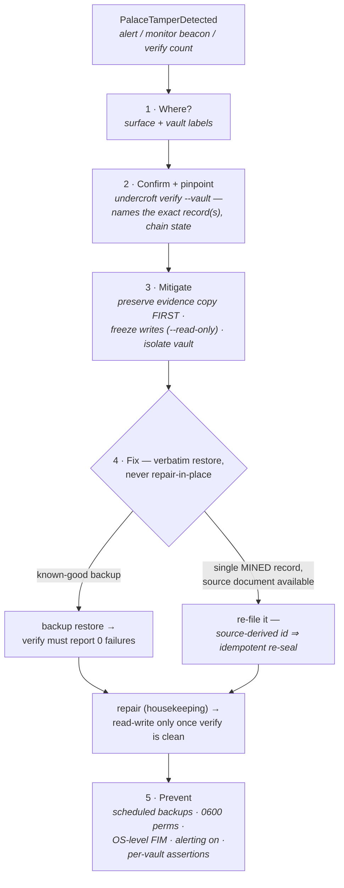

# Tamper runbook

When Undercroft raises **`PalaceTamperDetected`** (or the Palace Monitor's
ambulance beacon lights, or `undercroft verify` reports a non-zero `hmac
failures` count), a stored record failed its HMAC integrity tag on read. Treat
it as **on-disk tampering until proven otherwise**. This page is what the
alert's `runbook_url` points to.

> Integrity is cryptographic, not advisory: every drawer, KG triple, tunnel,
> and vault manifest carries an HMAC-SHA256 tag, and every write joins a
> tamper-evident audit chain. A verify failure means the bytes on disk no
> longer match what Undercroft sealed.

The whole procedure at a glance — each step is detailed below:



## 1. Where did it happen?

The alert carries two labels that localize the failure:

- **`surface`** — which structure failed: `drawer`, `kg`, `tunnel`, or
  `manifest`.
- **`vault`** — which vault (on the live event stream / Palace Monitor).

In Grafana, the **“Tamper by surface”** panel and the **HMAC verify failures**
stat show the same signal; the **Logs** panel shows the
`integrity failure — HMAC verification failed on <surface>` line.

## 2. Confirm and pinpoint the record

Run a full verification of the affected vault — it re-checks every record's
HMAC and replays the audit chain, naming the exact bad record(s):

```bash
undercroft verify --vault <vault>
# records checked: 1284
# hmac failures:   1
#   TAMPERED: 5a2fc91d…
# audit chain:     BROKEN
```

The named id is the tampered record; a `BROKEN` audit chain tells you the
tamper also broke chain continuity (an attacker who edited content but couldn't
forge the chain MAC).

## 3. Mitigate now (stop the bleeding)

1. **Preserve evidence first.** Copy the vault directory *before* anything else
   touches it — the DB, its `-wal`/`-shm`, `vault.json`, and `vault.json.next`
   if one is there. This comes before the restart on purpose: opening a store
   is not a pure read (schema creation, a rotation reconcile, chain init), and
   the rotation reconcile can **delete** `vault.json.next` or promote it over
   `vault.json`. The copy must predate the next open of any kind, read-only
   included — see step 2:
   ```bash
   cp -a "$UNDERCROFT_HOME/vaults/<vault>" "/tmp/<vault>.evidence.$(date +%s)"
   ```
2. **Freeze writes.** Restart the server read-only so nothing new is written on
   top of a compromised store while you investigate:
   ```bash
   undercroft serve-http --read-only …
   ```
   `--read-only` is a posture on the **whole process**, not a filter on one
   port: both stores the server opens take it, the gate sits in front of route
   dispatch and **fails closed** (everything is a mutation unless explicitly
   named otherwise), and the read-audit record and the embedder migration —
   both writes — are suppressed. Two exceptions are deliberate and worth
   knowing here: `POST …/verify` is allowed, because it only walks HMACs and
   replays the chain — it takes `&self` and writes nothing (it does **not**
   fast-forward the manifest anchor; an earlier version of this step said it
   did); and with `UNDERCROFT_RETRIEVAL=pq` a search may still build a missing
   PQ/IVF index, which is a write (a recorded gap, not a decision).

   > **The write that does happen, and why step 1 is not optional.**
   > `--read-only` bounds what *requests* may do. It does not make the
   > **open** a read, and the open runs on the first request of any kind
   > against a cold handle. Rotation reconciliation runs before the
   > read-only/read-write split, so if a key rotation was in flight when the
   > incident began, that first request either **promotes** the staged
   > `vault.json.next` over `vault.json` — adopting a new key generation —
   > or **deletes** it outright, both with an fsync. On a suspected
   > compromise that is potential evidence destruction on the very path
   > chosen to avoid touching the vault. Take the step-1 copy (including
   > `vault.json.next` if present) **before** any process opens the vault.
   > Tracked as ROADMAP R4/A32: a read-only open should detect and report
   > pending rotation state, never heal it.

   If your incident needs a byte-frozen vault, stop the server rather than
   restarting it.
3. **Isolate.** If this is a multi-tenant server, the vault id in the alert
   scopes the blast radius — other vaults have independent HKDF-derived keys, so
   one vault falling tells an attacker nothing about its siblings.

## 4. Fix (restore verbatim)

Undercroft never lossily transforms your data, so the fix is a **verbatim
restore**, not a repair-in-place of forged bytes:

1. **Restore from the most recent good backup.** `backup` refuses to run if the
   source failed verification, so a listed backup is known-good at capture time:
   ```bash
   undercroft backup list                          # names are <vault>-<stamp>
   undercroft backup restore <vault>-<stamp> --force   # --force to overwrite the live vault
   undercroft verify --vault <vault>   # must now report 0 hmac failures, chain ok
   ```
2. **If a single record was hit and you have the source document**, re-file it:
   a mined or swept drawer's id is derived from (wing, room, source, chunk
   index, normalize version), so re-mining is idempotent and simply re-seals
   the row. Re-verify afterwards. This does **not** hold for drawers written
   through `remember` / the API, which have no source and carry a unique append
   index instead — re-saving those creates a *new* drawer beside the tampered
   one rather than replacing it, so restore from backup is the only verbatim
   fix there.
3. **Housekeeping** after a clean restore:
   ```bash
   undercroft repair --vault <vault>  # backfill fingerprints, vacuum, re-verify
   ```

Only return the server to read-write once `verify` is clean.

## 5. Prevent (before the next time)

- **Back up on a schedule.** `undercroft backup create --vault <vault>` is the
  recovery path above; without a good backup, a verbatim restore isn't possible.
  Only the ten most recent snapshots per vault are kept — older ones are pruned
  on each create, so a schedule needs its own off-box retention.
- **Lock down the store.** The vault directory and `master.key` should be
  `0600`/owner-only. Anything that can write the vault DB out-of-band can
  tamper; anything that can read `master.key` can forge.
- **Add OS-level file-integrity monitoring** (auditd / a tripwire) on the vault
  directory — Undercroft catches tamper on *read*; FIM catches the *write*.
- **Keep telemetry alerting on.** `PalaceTamperDetected` fires within a scrape
  interval — that early signal is the point.
- **Use per-vault assertions** for multi-tenant deployments so a compromised
  client can't reach another tenant's vault.

## The guarantee

Tamper-evidence only works if the alarm is trustworthy — so Undercroft only ever
raises it on a **real** HMAC-verify failure. There are no synthetic or demo
tamper alarms anywhere in the system: metrics, the live event stream, and the
Palace Monitor beacon all read the same `hmac_verify_failures` signal.
