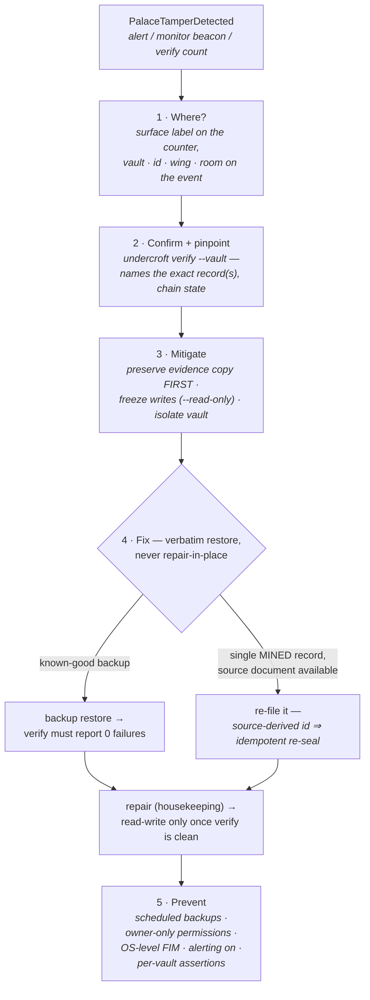

# Tamper runbook

When Undercroft raises **`PalaceTamperDetected`** (or the Palace Monitor's
ambulance beacon lights, or `undercroft verify` reports a non-zero `hmac
failures` count), a stored record failed its HMAC integrity tag on read. Treat
it as **on-disk tampering until proven otherwise**. This page is what the
alert's `runbook_url` points to.

> Integrity is cryptographic, not advisory: every drawer, KG triple, tunnel,
> and vault manifest carries an HMAC-SHA256 tag, and every write joins a
> tamper-evident audit chain. A verify failure means the bytes on disk no
> longer match what Undercroft sealed.

The whole procedure at a glance — each step is detailed below:



## 1. Where did it happen?

The alert carries two labels that localize the failure:

- **`surface`** — which structure failed: `drawer`, `kg`, `tunnel`, or
  `manifest`.
- **`instance`** — which server process counted it.

There is **no `vault` label**, on this alert or any other: the integrity
counter is emitted with `surface` alone. The vault is on the live event stream
instead — the `hmac-fail` frame the Palace Monitor reads names it, beside the
`id`, `wing` and `room` the failing row *claims* (marked `unverified`, since
that row has just failed its own HMAC). The stream is live only, so it names
the vault only to a subscriber connected when the failure happened; otherwise
run step 2's `verify` against each vault the process serves.

In Grafana, the **“Tamper by surface”** panel and the **HMAC verify failures**
stat show the same signal; the **Logs** panel shows the
`integrity failure — HMAC verification failed on <surface>` line.

## 2. Confirm and pinpoint the record

Run a full verification of the affected vault — it re-checks every record's
HMAC and replays the audit chain, naming the exact bad record(s):

```bash
undercroft verify --vault <vault>
# records checked: 1284
# hmac failures:   1
#   TAMPERED: 5a2fc91d…
# audit chain:     ok
# orphan labels:   0
# mirror drift:    0
# policy drift:    0
# VERIFY FAILED
```

The named id is the tampered record, and `VERIFY FAILED` exits **2**. Expect
`audit chain: ok` beside it: the chain is replayed from the audit trail's own
tags against the committed head and the manifest anchor, so editing the
tampered record's bytes does not move it. `audit chain: BROKEN` is a separate
finding — the audit trail itself was edited or truncated, or the database was
rolled back relative to the anchor. The next three lines are further legs, and
a non-zero count on any of them fails the verdict too; a vault holding
supersession links or fact receipts prints a line for each of those legs as
well, where only a tampered count fails.

## 3. Mitigate now (stop the bleeding)

1. **Preserve evidence first.** Copy the vault directory *before* anything else
   touches it — the DB, its `-wal`/`-shm`, `vault.json`, and `vault.json.next`
   if one is there:
   ```bash
   cp -a "$UNDERCROFT_HOME/vaults/<vault>" "/tmp/<vault>.evidence.$(date +%s)"
   ```
   Since 1.2.1 a read-only open (see step 2) writes nothing to the database,
   `vault.json`, `vault.json.next` or a hot `-wal`. In a writable directory it
   may still create the `-shm` wal-index and a zero-length `-wal` — SQLite's
   scaffolding for reading a WAL database, carrying no database content. From
   1.0.0 through 1.2.0 an embedder lookup ran before the posture took effect —
   on a `/v1` request from 1.0.0, and on the CLI's own read-only open from
   1.2.0 — and could create a missing database or checkpoint a crashed
   writer's hot `-wal` into it (ROADMAP O91), so on those versions the copy has
   to come before any process opens the vault. Take the copy on every version:
   it is the only thing that survives a *writable* process someone else
   starts, and a forensic copy costs seconds.
2. **Freeze writes.** Restart the server read-only so nothing new is written on
   top of a compromised store while you investigate:
   ```bash
   undercroft serve-http --read-only …
   ```
   `--read-only` is a posture on the **whole process**, not a filter on one
   port: both stores the server opens take it, the gate sits in front of route
   dispatch and **fails closed** (everything is a mutation unless explicitly
   named otherwise), and the read-audit record and the embedder migration —
   both writes — are suppressed. `POST …/verify` is allowed and is a genuine
   read: it walks every record's HMAC and replays the chain, and it does
   **not** fast-forward the manifest anchor (an earlier version of this step
   said it did).

   **The open is a read too — the open itself since 1.0.0, and the embedder
   lookup that ran ahead of it since 1.2.1 (step 1).** It used to be the one
   write `--read-only` did not bound, and the worst of it ran on the very path this
   step recommends: rotation reconciliation happened before the
   read-only/read-write split, so the first request against a cold handle
   either promoted a staged `vault.json.next` over `vault.json` — adopting a
   new key generation — or **deleted** it outright, with an fsync. That was
   potential evidence destruction on the path chosen to avoid touching the
   vault (ROADMAP R4/A32). Now the connection itself is opened
   `SQLITE_OPEN_READ_ONLY` under `PRAGMA query_only=ON`, the schema is checked
   rather than created, the anchor is reported rather than healed, a staged
   rotation is honoured **in memory only** and its file left exactly where it
   is, and a prefilter loads an index but never builds one. What the open
   declined to repair is printed as a warning and readable afterwards on
   `undercroft stats` (and `GET /v1/vaults/{id}/stats`) as `unhealed` — during
   an incident, read it: "a torn `vault.json.next` was left in place" tells
   you a rotation was in flight when the incident began. Since 1.2.0 the admin
   console at `GET /ui` shows it too, as an UNHEALED panel that appears only
   when there is something to say, beside a POSTURE gauge naming the role the
   handle was opened under. Before that the console showed a clean, complete-
   looking stats page for a replica with both conditions live.

   Two conditions refuse instead, both **409**, because serving through them
   would answer a question wrongly rather than partially: a manifest whose
   `vault.db` is absent (a half-copied backup or a snapshot taken mid-write —
   "empty" is not "absent", and this one exits **2**, an integrity verdict),
   and a schema this build would have had to migrate (open it once with a
   writable process, then retry).

   **The database is `vault.db` since 1.5.0**, beside `vault.json`; before
   that it was `palace.db`. A vault created earlier keeps that name until its
   first WRITABLE open, which checkpoints the WAL and renames it in place; a
   read-only open serves the file where it is and reports the pending rename
   on `unhealed`, so a replica of a not-yet-migrated primary says so rather
   than failing. A directory holding BOTH files is refused on either posture
   (409, exit 2 — one of them is a stray copy, and an open that picked one
   would serve the wrong vault silently): move the stray aside and reopen.
   Any script of yours that names the file — backups, the tamper demo in the
   observability README, a monitor — must name `vault.db`, or check for both.

   If your incident needs a byte-frozen vault, stop the server rather than
   restarting it. If the vault lives on a write-protected mount or a snapshot,
   the read-only open escalates to SQLite's `immutable=1` mode and says so in a
   warning — correct there, and wrong if anything is still writing, which is
   why it is reached only after the ordinary open has failed.
3. **Isolate.** If this is a multi-tenant server, the vault named by the
   `hmac-fail` event (or by `verify`) scopes the blast radius — other vaults
   have independent HKDF-derived keys, so one vault falling tells an attacker
   nothing about its siblings.

## 4. Fix (restore verbatim)

Undercroft never lossily transforms your data, so the fix is a **verbatim
restore**, not a repair-in-place of forged bytes:

1. **Restore from the most recent good backup.** `backup` refuses to run if the
   source failed verification, so a listed backup is known-good at capture time:
   ```bash
   undercroft backup list                          # names are <vault>-<stamp>
   undercroft backup restore <vault>-<stamp> --force   # --force to overwrite the live vault
   undercroft verify --vault <vault>   # must now report 0 hmac failures, chain ok
   ```
2. **If a single *mined* record was hit and you have the source document**,
   re-mine it with the same path, `--wing` and `--mode` it was mined with: a mined
   drawer's id is derived from (wing, room, source, chunk index, normalize
   version), so re-mining rewrites that row under a fresh seal. Re-verify
   afterwards. This does **not** hold for drawers filed by `sweep`, which skips
   any message whose content fingerprint is already stored — and an edit to the
   content bytes leaves the fingerprint column in place, so a re-sweep counts
   the tampered message as already filed and never rewrites it. Nor does it
   hold for drawers written through `remember` / the API, which have no source
   and carry a unique append index instead — re-saving those creates a *new*
   drawer beside the tampered one rather than replacing it. Restore from backup
   is the only verbatim fix for both.
3. **Housekeeping** after a clean restore:
   ```bash
   undercroft repair --vault <vault>  # backfill fingerprints, re-embed every drawer + drop PQ/IVF (a served embedder receives the corpus, recorded as egress/embed/repair), vacuum, re-verify
   ```

Only return the server to read-write once `verify` is clean.

## 5. Prevent (before the next time)

- **Back up on a schedule.** `undercroft backup create --vault <vault>` is the
  recovery path above; without a good backup, a verbatim restore isn't possible.
  Only the ten most recent snapshots per vault are kept — older ones are pruned
  on each create, so a schedule needs its own off-box retention.
- **Lock down the store.** `master.key` should be `0600` and the vault
  directory `0700` (owner-only). Anything that can write the vault DB
  out-of-band can tamper; anything that can read `master.key` can forge.
- **Back up the key material too.** `backup create` copies the vault, not
  `master.key` or `kdf.salt`, and a backup opens only under this installation's key.
  Never delete either file to silence a message: the engine refuses a key
  source the installation contradicts rather than writing a new key (ROADMAP O204),
  and an installation an older release left holding both files may have vaults under
  each.
- **Add OS-level file-integrity monitoring** (auditd / a tripwire) on the vault
  directory — Undercroft catches tamper on *read*; FIM catches the *write*.
- **Keep telemetry alerting on.** `PalaceTamperDetected` fires within a scrape
  interval — that early signal is the point.
- **Use per-vault assertions** for multi-tenant deployments so a compromised
  client can't reach another tenant's vault.

## The guarantee

Tamper-evidence only works if the alarm is trustworthy — so Undercroft only ever
raises it on a **real** HMAC-verify failure. There are no synthetic or demo
tamper alarms anywhere in the system: metrics, the live event stream, and the
Palace Monitor beacon all read the same `hmac_verify_failures` signal.
